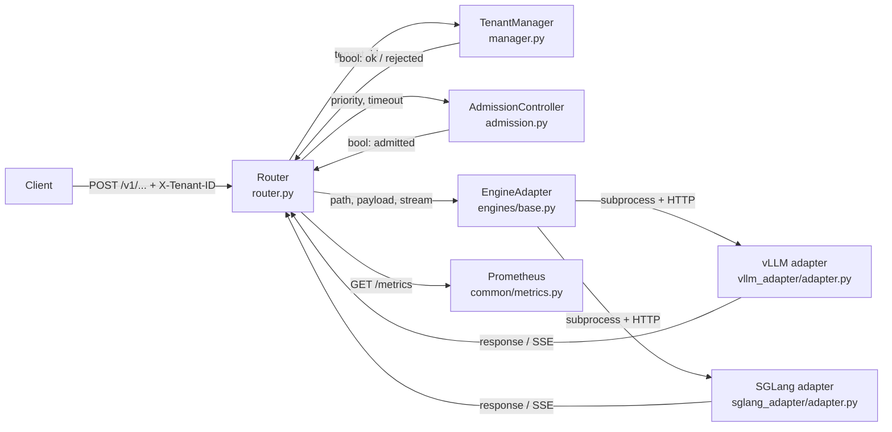
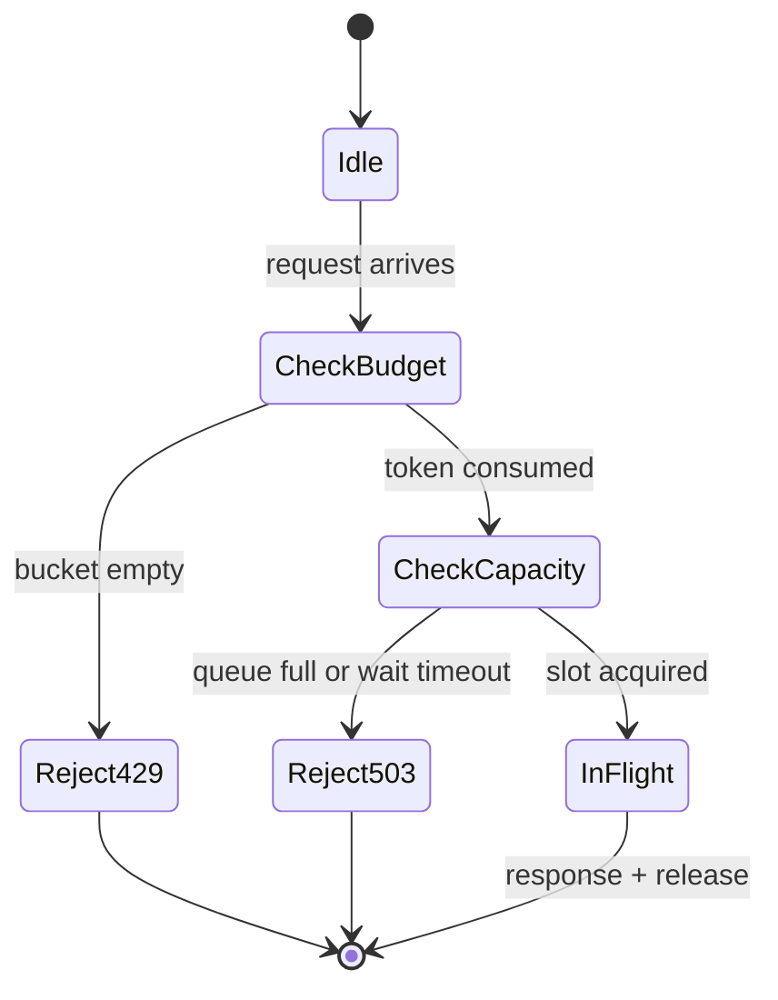

# kvwarden design

For someone considering contributing or weighing whether this architecture matches their problem. Deeper than `overview.md` but still one sitting.

## Design principles

- **Admission-layer, not engine-layer.** Everything kvwarden does happens in a Python process in front of vLLM/SGLang. No engine fork, no CUDA code, no kernel patch. The cost: we only have request-level knobs (admit / reject / delay), not per-step batcher knobs. The benefit: ships today against off-the-shelf vLLM 0.19.1+ and moves with upstream.
- **Token bucket, not WFQ or DRR.** A per-tenant leaky bucket is enough to take the quiet-tenant p99 from 1,585 ms back to 61.5 ms under a 32-RPS flood. Weighted Fair Queuing needs a per-request work estimate; under variable-length LLM output that estimate is wrong often enough to make WFQ underperform a dumb bucket. See the "Why token-bucket and not X?" section below.
- **Single-node, not distributed.** One kvwarden process, one GPU box. Multi-node scheduling is the Dynamo/llm-d problem. The single-node gap (between `ollama run` and a K8s operator) is the one we fill.
- **Middleware, not fork.** You run `pip install kvwarden` on top of a working `vllm serve`. If you can't run plain vLLM, kvwarden can't help. If you can, it is a drop-in in front.
- **OpenAI API compatible.** Clients don't know kvwarden exists. The only wire protocol difference is an optional `X-Tenant-ID` header — if absent, everything lands on the `default` tenant and kvwarden degrades into a thin proxy.
- **Honest about what it is.** The package is named `kvwarden` because tenant-aware KV-cache eviction is the 0.2 direction (see issue #103). Today the KV-cache manager is a scaffold. We say so on the tin.
- **Length-bucketed scheduling is an aside, not the thesis.** The router sorts waiting requests into short/medium/long/xlarge buckets with a 4/2/1/1 worker split to keep short requests ahead of long ones — nice, but not the hero mechanism. The fairness result is token-bucket.

## Component diagram



Arrows read: the router hands the tenant id to `TenantManager.try_acquire_for_tenant`, gets back a `bool`. On true, it hands `(priority, timeout)` to `AdmissionController.acquire`, gets back a `bool`. On true, it hands `(path, payload, stream)` through the abstract `EngineAdapter.forward_request` into one of the two concrete adapters, which own the engine subprocess and the HTTP hop. The response — JSON or an async SSE generator — flows back the same way. `/metrics` is served straight off the shared `MetricsCollector`.

## Admission-gate state machine



Five states, matching `WorkloadRouter.route_request` in `router/router.py`. `CheckBudget` is `TenantManager.try_acquire_for_tenant` (token bucket + per-tenant concurrency cap). `CheckCapacity` is `AdmissionController.acquire` (global `max_concurrent` with a priority queue of waiters, 30s wait timeout). `InFlight` spans both the request/response path and — for streaming — the lifetime of the async SSE generator; `release()` runs in the `finally` of `_stream_with_admission` so client disconnects, engine timeouts, and normal completion all converge on the same release.

## Key data structures

Grepped from the source, not invented. The token-bucket state is deliberately split from the static budget config — the first is runtime mutable, the second is user-set.

Tenant budget (static, per-tenant config) — `src/kvwarden/tenant/manager.py`:

```python
@dataclass
class TenantBudget:
    max_concurrent_requests: int = 64
    rate_limit_rpm: int = 600
    rate_limit_burst: int | None = None   # token-bucket capacity
    max_gpu_memory_gb: float = 40.0
    priority: int = 1
```

Token-bucket runtime state (lives on `TenantRecord`, not `TenantBudget`):

```python
# in TenantRecord.__init__
self._token_capacity: float = float(
    budget.rate_limit_burst if budget.rate_limit_burst is not None
    else budget.rate_limit_rpm
)
self._tokens: float = self._token_capacity
self._refill_per_sec: float = budget.rate_limit_rpm / 60.0
self._last_refill_t: float = time.monotonic()
```

Pending request (the envelope that rides the length-bucketed scheduling queues) — `src/kvwarden/router/router.py`:

```python
@dataclass
class PendingRequest:
    request_id: str
    model_id: str
    path: str
    payload: dict[str, Any]
    tenant_id: str
    bucket: str              # "short" | "medium" | "long" | "xlarge"
    enqueue_time: float
    future: asyncio.Future[Any]
```

Admission contract — there is no `AdmissionDecision` type. `AdmissionController.acquire(priority, timeout)` returns `bool`; timeouts surface as `AdmissionTimeoutError` (with `queue_depth` and `in_flight` attributes) raised by the router, and tenant-budget rejections surface as `BudgetExceededError`. Keeping the return type a plain `bool` keeps the hot path allocation-free.

## Why token-bucket and not X?

**Weighted Fair Queuing.** WFQ assigns virtual finish-times per packet using `size / weight`. For LLM requests that means estimating work — input tokens plus an `max_tokens` output budget, neither of which is a good proxy for actual generation time (stop tokens, dynamic batching, speculative decoding all invalidate it). When your work estimate is wrong by 5x on a fifth of requests, WFQ's ordering guarantees turn into ordering noise and you pay the complexity without the fairness. A token bucket makes no work estimate — it just rate-limits arrivals — and the empirical result (29x starvation down to 1.14x) is the tell.

**Deficit Round Robin.** DRR tracks a per-flow deficit counter and drains quanta in rotation. It works when you have many small flows and want throughput fairness. kvwarden's common case is 2-10 tenants, one large engine queue, and a latency (TTFT) fairness goal. DRR's state per flow, plus the rotation pointer, is more machinery than a per-tenant `(tokens, last_refill)` pair, and the win over the bucket is marginal at these tenant counts. (We do still borrow one DRR-shaped idea: the optional `scheduling: drr` mode in the admission priority calculation adds `active_requests * 10` to each tenant's priority, so a tenant currently hogging in-flight slots drops behind quieter ones. That is a tie-breaker on admission ordering, not a replacement for the bucket.)

**Priority queues with SLO tiers.** You need SLO definitions to have SLO-aware priorities. Today our tenants do not ship with SLOs — they ship with budgets. Asking operators to write "gold tier gets p99 TTFT < 100ms" before they can use the product is a nonstarter for the Ollama-to-Dynamo audience. We may add priority tiers in 0.2 once we have real operator data on what SLO shapes they care about; until then, `priority: 1` is the default and the bucket does the work.

**Latency-based backoff (AIMD, BBR-style).** Reactive schemes wait until p99 TTFT is already degraded, then back off. That's a lagging signal. A flood hits hard within a second and the damage is done before a latency-observer controller has a chance to react. The bucket is proactive — it never lets the flooder get to the engine in the first place, so p99 never degrades.

## What the cache manager IS and ISN'T

`src/kvwarden/cache/manager.py` is a 488-line scaffold with a tiered-eviction model: `allocate_block`, `access_block`, `promote_block`, `demote_block`, `_evict_from_tier`, all present and tested in isolation. What is NOT present is any connection to the engine's actual KV cache. vLLM manages its own KV blocks; we do not share an address space with it.

What the router calls today, from `router.py`:

- `cache_manager.free_blocks_for_model(model_id)` on model unload (line 346)
- `cache_manager.snapshot()` in the `/status` payload (line 1006)

That's it. `allocate_block` and the eviction methods are dead from the router's point of view. We are not pretending otherwise.

Issue #103 is the "name-truth" thrust — the work of actually wiring a tenant-aware eviction policy into the engine's block manager (which for vLLM means either a fork or an upstream extension point that does not exist yet). That's 0.2, not 0.1.3.

## Observed results matrix

| Shape | Model | GPU(s) | Solo p99 TTFT | FIFO p99 under flood | Token-bucket p99 | Source |
|---|---|---|---:|---:|---:|---|
| Hero | Llama-3.1-8B | 1x A100 80GB | 53.9 ms | 1,585 ms (29x) | 61.5 ms (1.14x) | `results/gate2_preprint_v3/` |
| Scaling, dense 70B | Llama-3.1-70B TP=4 | 4x H100 80GB | 766.8 ms | not measured (see note) | 1,238.6 ms | `results/gate23_70b_tp4_20260421/` |
| Scaling, MoE | Mixtral-8x7B TP=2 | 2x H100 80GB | 84.9 ms | 122.7 ms (1.45x) | 109.7 ms | `results/gate24_mixtral_20260421/` |

The full story, including the FIFO-not-measured caveat on the 70B arm and the engine-load delta that drives the 1.94x Mixtral fairness ratio, is in `docs/launch/frontier_coverage.md`. Don't re-derive it here.
