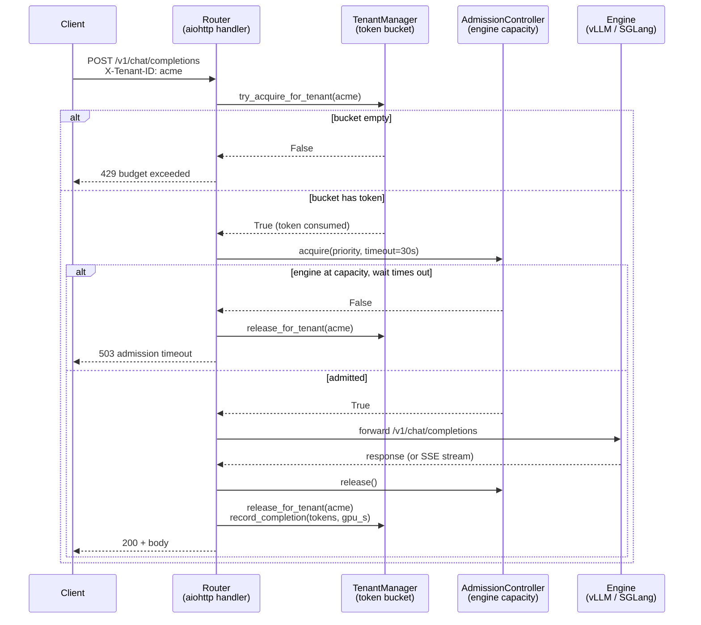

# kvwarden architecture overview

One page, read this first.

## The problem

Two tenants hit the same GPU. Tenant A sends one request per second. Tenant B floods at 32 RPS. vLLM has no notion of "tenant" — it drains its request queue in arrival order, so Tenant A's request sits behind whatever Tenant B submitted last.

On A100 + Llama-3.1-8B + vLLM 0.19.1, with that 1-RPS-vs-32-RPS shape, the quiet tenant's p99 time-to-first-token goes from a 53.9 ms solo baseline to **1,585 ms under the flooder** — 29x worse. That is the FIFO admission behaviour you inherit from stock vLLM (or SGLang, or any engine that doesn't model tenants). See `results/gate2_preprint_v3/` for the full trace and `docs/launch/gate0_launch_post.md` for the narrative.

The engine itself is fine. vLLM's continuous batcher is doing exactly what it should. The gap is that no one upstream of the engine is saying "you, tenant B, have already filled your share — wait."

## The mechanism

kvwarden is a middleware process that sits between the client and the engine. Clients talk to kvwarden on an OpenAI-compatible endpoint; kvwarden forwards to a local vLLM or SGLang process.

Between those two hops it runs a **per-tenant token bucket**. Each tenant has a bucket with a refill rate (requests per minute / 60) and a burst capacity. Every incoming request consumes one token. If the bucket is empty, the request is rejected with HTTP 429 before it ever reaches the engine queue. If the bucket has a token, the request passes a second gate (`AdmissionController`, bounded by `max_concurrent` in-flight to protect the engine from the throughput-saturation cliff) and is forwarded.

With that one mechanism in place, on the same hardware and flood shape, the quiet tenant's p99 TTFT comes back to **61.5 ms — 1.14x the solo baseline.** The flooder still gets served; it just can't starve the other tenant any more.

No engine fork, no CUDA code, no kernel patch. vLLM 0.19.1 off the shelf.

## The request flow

Two gates, in that order. The token bucket is what produces the 29x-to-1.14x result; the admission controller is engine-overload protection (see the c=128 to c=256 TTFT cliff documented in `src/kvwarden/router/admission.py`).

## Where the code lives

| Component | File |
|---|---|
| Router entry + aiohttp handlers | `src/kvwarden/router/router.py` |
| Tenant budget + token bucket | `src/kvwarden/tenant/manager.py` |
| Admission gate (concurrency cap + priority queue) | `src/kvwarden/router/admission.py` |
| Engine adapter base | `src/kvwarden/engines/base.py` |
| vLLM adapter | `src/kvwarden/engines/vllm_adapter/adapter.py` |
| SGLang adapter | `src/kvwarden/engines/sglang_adapter/adapter.py` |
| KV cache manager (scaffold, not hot path) | `src/kvwarden/cache/manager.py` |
| Prometheus metrics | `src/kvwarden/common/metrics.py` |
| Config dataclasses | `src/kvwarden/common/config.py` |
| CLI | `src/kvwarden/cli.py` |

Note on the cache manager: the file name implies kvwarden does KV-cache wardening today. It doesn't. The router only calls `free_blocks_for_model()` on unload and `snapshot()` for the status endpoint. Tenant-aware eviction is tracked in issue #103 and is the 0.2 milestone — see `design.md` for what's there vs what's not.

## Where kvwarden does NOT fit

If you're doing any of the below, kvwarden is the wrong tool and the right tool is named on the right.

- **K8s-native multi-node GPU scheduling** → [Dynamo](https://github.com/ai-dynamo/dynamo) or [llm-d](https://github.com/llm-d/llm-d). kvwarden is a single-node middleware process. It has no notion of cluster, placement, or pod.
- **Hosted inference you pay per token for** → [OpenRouter](https://openrouter.ai), [Together](https://together.ai), [Fireworks](https://fireworks.ai). kvwarden is software you run yourself on your own GPU.
- **Cost optimisation / multi-provider routing** → OpenRouter or a gateway like LiteLLM. kvwarden does not shop across providers.
- **Training orchestration, RLHF, fine-tuning** → not remotely in scope.
- **A vLLM/SGLang replacement** → kvwarden runs the engine as a subprocess. The engine still does the inference work. kvwarden only controls what gets let in.

The target user is someone running `vllm serve` on one box, shipping to multiple internal teams or external customers, and discovering that one team's burst is ruining the other team's latency. That shape is the Ollama-to-Dynamo gap this project addresses.
